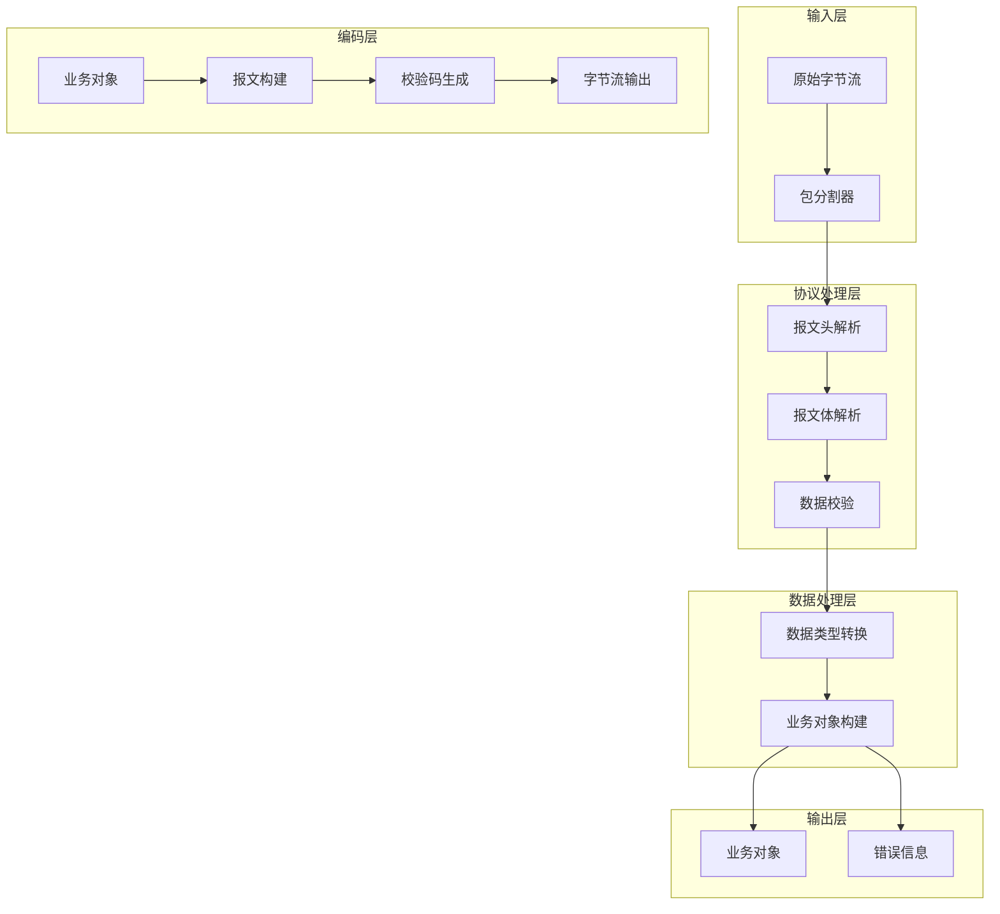

# 第一层

```mermaid
flowchart TD
    subgraph Input [输入层]
        A[原始字节流] --> B[包分割器]
    end

    subgraph Protocol [协议处理层]
        B --> C[报文头解析]
        C --> D[报文体解析]
        D --> E[数据校验]
    end

    subgraph DataProcess [数据处理层]
        E --> F[数据类型转换]
        F --> G[业务对象构建]
    end

    subgraph Output [输出层]
        G --> H1[业务对象]
        G --> H2[错误信息]
    end

    subgraph Encode [编码层]
        I[业务对象] --> J[报文构建]
        J --> K[校验码生成]
        K --> L[字节流输出]
    end
```
